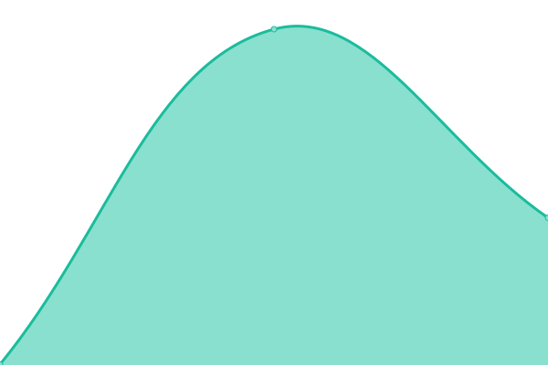
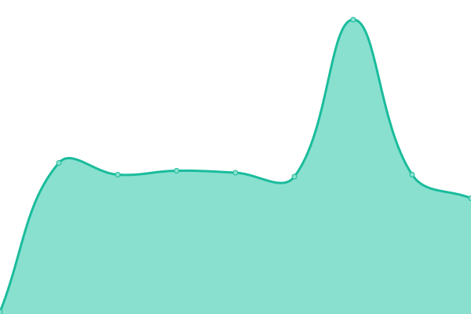

# [📈 Live Status](https://petedreams.github.io/kanshi): <!--live status--> **🟧 Partial outage**

This repository contains the open-source uptime monitor and status page for [petedreams](https://petedreams.github.io/kanshi), powered by [Upptime](https://github.com/upptime/upptime).

With [Upptime](https://upptime.js.org), you can get your own unlimited and free uptime monitor and status page, powered entirely by a GitHub repository. We use [Issues](https://github.com/petedreams/kanshi/issues) as incident reports, [Actions](https://github.com/petedreams/kanshi/actions) as uptime monitors, and [Pages](https://petedreams.github.io/kanshi) for the status page.

<!--start: status pages-->
<!-- This summary is generated by Upptime (https://github.com/upptime/upptime) -->
<!-- Do not edit this manually, your changes will be overwritten -->
<!-- prettier-ignore -->
| URL | Status | History | Response Time | Uptime |
| --- | ------ | ------- | ------------- | ------ |
|  [Docomo](https://www.nttdocomo.co.jp/) | 🟩 Up | [docomo.yml](https://github.com/petedreams/kanshi/commits/HEAD/history/docomo.yml) | 

 945ms
     
 | 

<a href="https://petedreams.github.io/kanshi/history/docomo">100.00%</a>
    

|  [Amazon](https://www.amazon.co.jp) | 🟩 Up | [amazon.yml](https://github.com/petedreams/kanshi/commits/HEAD/history/amazon.yml) | 

 397ms
     
 | 

<a href="https://petedreams.github.io/kanshi/history/amazon">100.00%</a>
    

|  [Google](https://www.google.com) | 🟩 Up | [google.yml](https://github.com/petedreams/kanshi/commits/HEAD/history/google.yml) | 

 72ms
     
 | 

<a href="https://petedreams.github.io/kanshi/history/google">100.00%</a>
    

|  [Shippai Site](https://thissitedoesnotexist.com) | 🟥 Down | [shippai-site.yml](https://github.com/petedreams/kanshi/commits/HEAD/history/shippai-site.yml) | 

 0ms
     
 | 

<a href="https://petedreams.github.io/kanshi/history/shippai-site">10.02%</a>
    

<!--end: status pages-->

[**Visit our status website →**](https://petedreams.github.io/kanshi)

## 📄 License

- Powered by: [Upptime](https://github.com/upptime/upptime)
- Code: [MIT](./LICENSE) © [petedreams](https://petedreams.github.io/kanshi)
- Data in the `./history` directory: [Open Database License](https://opendatacommons.org/licenses/odbl/1-0/)
